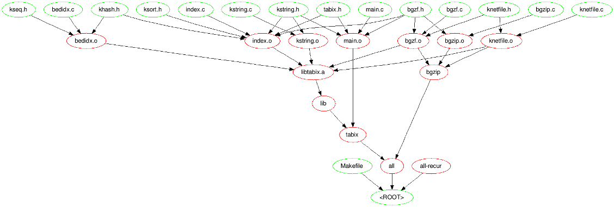
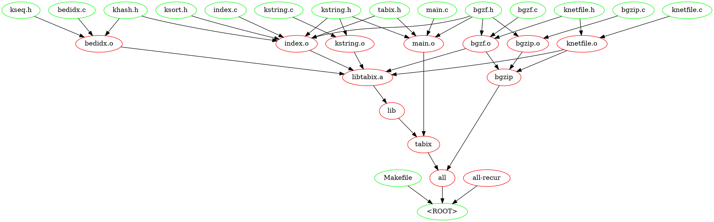

makefile2graph
==============

Creates a graph of dependencies from GNU-Make ( http://www.gnu.org/software/make/manual/make.html )

Output is a graphviz-dot file ( http://www.graphviz.org/ ), a Gexf-XML file ( https://gephi.github.io/ ) or a list of the deepest independent targets that should be make.

sub-makefiles are not supported.


## History

* 2014-12-31 added option `--format`, removed otpions 'x' and 'd'
* 2014-12-22 added 'deep' output. I need this when I'm working on a cluster and I need to know the deepest independent targets that should be make.
* 2014-10-07 print version
* 2014-10-06 added --root option
* 2014-09-17 added long_opt , options basename and suffix
* 2014-09-16 fixed new format for GNU make v4.0


## Screenshot



## Compilation

```
make
```

## Options

* -h|--help help (this screen)
* -f|--format (format)
    * (d)ot graphiz dot output format (default).
    * (x)xml (g)exf XML output (gexf)
    * (E) print the deepest indepedent targets.
    * (L)ist all targets.
* -s|--suffix only print file extension
* -b|--basename  only print file basename
* -r|--root  show root node
* -v|--version print version

## Usage

```
make -Bnd | make2graph > output.dot
```

```
make -Bnd | make2graph | dot -Tpng -o out.png
```

```
make -Bnd | make2graph --format x > output.xml
```

## Locale

make2graph only parses english messages from GNU make. If you're using another locale, you should set `LC_ALL=C`. 


## Examples

### Tabix 0.2.5 - DOT

```bash
$ cd tabix-0.2.5
$ make -Bnd |make2graph
```


### Tabix 0.2.5 - XML

```bash
$ cd tabix-0.2.5
$ make -Bnd |make2graph --format x
```

```xml
<?xml version="1.0" encoding="UTF-8"?>
<gexf xmlns="http://www.gexf.net/1.2draft" version="1.2">
  <meta>
    <creator>Pierre Lindenbaum</creator>
    <description>Makefile Graph</description>
  </meta>
  <graph mode="static" defaultedgetype="directed">
    <attributes class="node" mode="static"/>
    <nodes>
      <node id="n1" label="&lt;ROOT&gt;"/>
      <node id="n2" label="Makefile"/>
      <node id="n4" label="all"/>
      <node id="n3" label="all-recur"/>
      <node id="n23" label="bedidx.c"/>
      <node id="n22" label="bedidx.o"/>
      <node id="n9" label="bgzf.c"/>
      <node id="n10" label="bgzf.h"/>
      <node id="n8" label="bgzf.o"/>
      <node id="n27" label="bgzip"/>
      <node id="n29" label="bgzip.c"/>
      <node id="n28" label="bgzip.o"/>
      <node id="n18" label="index.c"/>
      <node id="n17" label="index.o"/>
      <node id="n20" label="khash.h"/>
      <node id="n16" label="knetfile.c"/>
      <node id="n11" label="knetfile.h"/>
      <node id="n15" label="knetfile.o"/>
      <node id="n24" label="kseq.h"/>
      <node id="n21" label="ksort.h"/>
      <node id="n13" label="kstring.c"/>
      <node id="n14" label="kstring.h"/>
      <node id="n12" label="kstring.o"/>
      <node id="n6" label="lib"/>
      <node id="n7" label="libtabix.a"/>
      <node id="n26" label="main.c"/>
      <node id="n25" label="main.o"/>
      <node id="n5" label="tabix"/>
      <node id="n19" label="tabix.h"/>
    </nodes>
    <edges>
      <edge id="E1" type="directed" source="n2" target="n1"/>
      <edge id="E2" type="directed" source="n4" target="n1"/>
      <edge id="E3" type="directed" source="n3" target="n1"/>
      <edge id="E4" type="directed" source="n27" target="n4"/>
      <edge id="E5" type="directed" source="n5" target="n4"/>
      <edge id="E6" type="directed" source="n23" target="n22"/>
      <edge id="E7" type="directed" source="n20" target="n22"/>
      <edge id="E8" type="directed" source="n24" target="n22"/>
      <edge id="E9" type="directed" source="n9" target="n8"/>
      <edge id="E10" type="directed" source="n10" target="n8"/>
      <edge id="E11" type="directed" source="n11" target="n8"/>
      <edge id="E12" type="directed" source="n8" target="n27"/>
      <edge id="E13" type="directed" source="n28" target="n27"/>
      <edge id="E14" type="directed" source="n15" target="n27"/>
      <edge id="E15" type="directed" source="n10" target="n28"/>
      <edge id="E16" type="directed" source="n29" target="n28"/>
      <edge id="E17" type="directed" source="n10" target="n17"/>
      <edge id="E18" type="directed" source="n18" target="n17"/>
      <edge id="E19" type="directed" source="n20" target="n17"/>
      <edge id="E20" type="directed" source="n21" target="n17"/>
      <edge id="E21" type="directed" source="n14" target="n17"/>
      <edge id="E22" type="directed" source="n19" target="n17"/>
      <edge id="E23" type="directed" source="n16" target="n15"/>
      <edge id="E24" type="directed" source="n11" target="n15"/>
      <edge id="E25" type="directed" source="n13" target="n12"/>
      <edge id="E26" type="directed" source="n14" target="n12"/>
      <edge id="E27" type="directed" source="n7" target="n6"/>
      <edge id="E28" type="directed" source="n22" target="n7"/>
      <edge id="E29" type="directed" source="n8" target="n7"/>
      <edge id="E30" type="directed" source="n17" target="n7"/>
      <edge id="E31" type="directed" source="n15" target="n7"/>
      <edge id="E32" type="directed" source="n12" target="n7"/>
      <edge id="E33" type="directed" source="n10" target="n25"/>
      <edge id="E34" type="directed" source="n14" target="n25"/>
      <edge id="E35" type="directed" source="n26" target="n25"/>
      <edge id="E36" type="directed" source="n19" target="n25"/>
      <edge id="E37" type="directed" source="n6" target="n5"/>
      <edge id="E38" type="directed" source="n25" target="n5"/>
    </edges>
  </graph>
</gexf>
```

### Deep output 

deep output was needed when using a cluster:  I needed a list of all deepest independant targets that must be re-built.

For the following Makefile

```make
NUMS=1 2 3 4 5
.PHONY:all clean 
%.c: %.b
	echo "$<" > $@


%.b: %.a
	echo "$<" > $@

%.a:
	echo "$@" > $@

all:$(addsuffix .c,${NUMS})

clean:
	rm -f $(foreach P,a b c,$(addsuffix .${P},${NUMS})) 
```

make a few targets:

```
$ make  1.a 2.a 3.b 4.c 
echo "1.a" > 1.a
echo "2.a" > 2.a
echo "3.a" > 3.a
echo "3.a" > 3.b
echo "4.a" > 4.a
echo "4.a" > 4.b
echo "4.b" > 4.c
rm 3.a 4.a 4.b
```

deep output :
```
$ make -nd  all  | ./make2graph --format e
1.b
2.b
3.c
5.a
```

build other targets

```
$ make  1.b 3.c
echo "1.a" > 1.b
echo "3.b" > 3.c
```


new deep output :

```
$ make -nd  all  | ./make2graph --format e
1.c
2.b
5.a
```


## Gallery

https://twitter.com/yokofakun/status/514329843065167872


https://twitter.com/yokofakun/status/278086490809040896


## Misc

<blockquote class="twitter-tweet" lang="en"><p><a href="https://twitter.com/yokofakun">@yokofakun</a> Using your <a href="https://t.co/Z1xg8dhW2r">https://t.co/Z1xg8dhW2r</a>, and Graphviz 2.36 for OS X. Large graph. How can I scale it better? <a href="http://t.co/d6ZQX2MnqH">pic.twitter.com/d6ZQX2MnqH</a></p>&mdash; Lex Nederbragt (@lexnederbragt) <a href="https://twitter.com/lexnederbragt/status/502165603076288512">August 20, 2014</a></blockquote>
<script async src="//platform.twitter.com/widgets.js" charset="utf-8"></script>

>
> try the gexf+ #gephi output or another grafviz algo like neato
> 

## See also

  * J4Make https://github.com/lindenb/j4make java equivalent of makefile2graph

